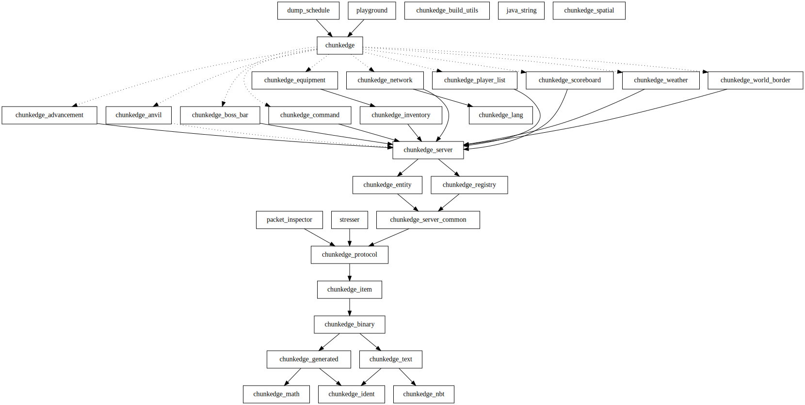

# Crates

The standard crates used in ChunkEdge projects.

All crates here are exported by the main `chunkedge` crate. `chunkedge` is the intended interface for both end users and third-party plugin authors.

Crates are versioned in lockstep with the exception of `chunkedge_nbt`.

The output of `cargo depgraph --workspace-only | tred | dot -Tsvg -o assets/depgraph.svg` looks like this:

